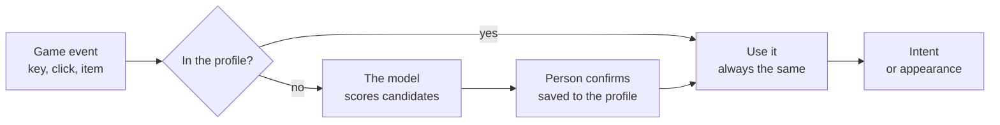

import { Callout } from 'nextra/components'

# How the model decides

<Callout type="warning">The Signet 2 resolver below is still a draft. A first decision model already runs in the lab doors server: [signet-forge-dm-qwen35-0.8b-clef-distill-v1](https://github.com/signetprotocol/signet/tree/main/models/signet-forge-dm-qwen35-0.8b-clef-distill-v1).</Callout>

The model does not "invent" translations. It works like someone who is shown a list of options and asked which one fits best. For this we propose a **contrastive ranking model**, for example [CLM-v0.1-8B](https://huggingface.co/Contrastive-LM/CLM-v0.1-8B) (Contrastive-LM, Apache-2.0 license): it receives a situation and a list of candidates, and returns each candidate with a score.

```text
Situation:   archetype "weapon.ranged", game Minecraft
Candidates:  bow · crossbow · fishing rod · snowball · trident
Result:      (illustrative example, not a real measurement)
             bow 0.81 · crossbow 0.74 · trident 0.55 · snowball 0.31 · fishing rod 0.22
```

Advantages of this approach:

- **It cannot go outside the list.** Since it only scores candidates, it never proposes something the game does not have or an intent that does not exist.
- **It is explainable.** You see the scores of every option, not just the winner.
- **It is replaceable.** The resolver is an interface: a model today, a better one tomorrow, or a hand-written table.

## The lab model

`signet-forge-dm-qwen35-0.8b-clef-distill-v1` is Qwen3.5-0.8B with Clef's decision head, trained on Clef's soft scores over a short BM25 list. It only ranks ids that already exist in the receiving game's catalog. In the lab it answers in about 7 ms on a local GPU, and a person approves the choice once. The weights are in this repository (Git LFS). The catalogs they rank are not: each catalog is extracted from the player's own game.

The measurements and the training recipe are in the [model card](https://github.com/signetprotocol/signet/blob/main/models/signet-forge-dm-qwen35-0.8b-clef-distill-v1/README.md). The doors server that asks Forge is [`lab/server`](https://github.com/signetprotocol/signet/tree/main/lab/server). Its wire is not the SDK Signet/1 protocol.

## Decision order



The fast path is used almost always. The model only steps in the first time something new appears.

Priority when there are several sources:

1. What the **player** pinned.
2. The translator's **profile**.
3. The **model's** suggestion.
4. A safe **default**.

<Callout type="info">
**The model is never in the game loop.** The server simulates 20 times per second and a model of this size needs a GPU. So the model works before playing or when something new appears, and its answer is saved. During the match only the profile is consulted, which is instant.
</Callout>
