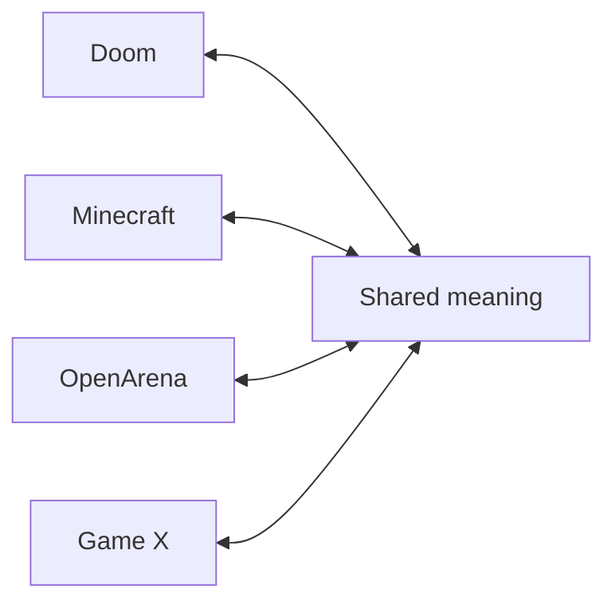

import { Callout, Cards } from 'nextra/components'

# Signet Forge

<Callout type="warning">
**Draft proposal, not implemented yet.** Signet Forge and the intents and archetypes architecture are part of Signet 2. This section is the full design document, so the community can shape it before it is built. Download it as a [PDF](/signet-2-architecture.pdf), or give feedback in [Discussions](https://github.com/signetprotocol/signetprotocol/discussions).
</Callout>

## One-minute summary

- **Today**, for two games to play together you have to translate one into the other, piece by piece. Every new game adds more work.
- **Signet 2** proposes something else: each game translates **into a shared meaning** and **out of a shared meaning**. The server only understands meaning: what the player wants to do (*intents*) and what exists in the world (*archetypes*).
- Each game keeps what makes it unique: its interface, its mechanics, its animations. It only decides **how to show** each archetype and **which button means what**.
- Before playing, the player **sets up their controls** once, like in any game. That solves everything obvious without artificial intelligence.
- For what is not obvious, an **AI model picks from a closed list of options** and a person confirms. The decision is saved and from then on it is always the same.
- **Signet Protocol** is the standard: protocol, SDK and standard translator. **Signet Forge** is a separate tool to create, review and improve translations on top of that standard.

## The problem

A game is much more than its world: it has its own controls, its own items, its own way of moving and shooting. When we want a Minecraft player and a Doom player in the same match, we have to answer questions like these:

- Doom has a pistol. Minecraft does not. What is the Minecraft player holding?
- A modern game lets you jump, crouch and slide. An old one does not. What happens when someone jumps?
- Every engine sends "move forward" in a different way. How does the server know it is the same thing?

If we solve this **pair by pair** (Doom↔Minecraft, Doom↔OpenArena, Minecraft↔OpenArena…), 10 games make 45 pairs and 20 games make 190. It does not scale, and every pair piles up special cases.

## The idea in one sentence

<Callout type="info">
**Do not translate from game to game. Translate from game to meaning, and from meaning to game.**
</Callout>

This way each new game only needs **one** translator, to and from the shared meaning, and it can automatically play with all the others.

With a shared meaning, the number of translators grows at the same rate as the number of games: 4 translators for 4 games, instead of 6 pair-by-pair translators.

## The standard and the companion tool

| | Signet Protocol (the standard) | Signet Forge (companion tool) |
|---|---|---|
| **What it is** | The protocol, the SDK and the **standard translator** | An application to create, review and improve translations |
| **Includes** | Intent vocabulary, archetype catalog, capabilities, translation API, profile format, calibration wizard, reference server | Game discovery, suggestion review, profile editing, pending queue, dataset, model fine-tuning |
| **Needed to play?** | Yes | **No.** Only for people who build translators |
| **Uses AI?** | Not during the match: it only reads profiles | Yes, to suggest and to train |
| **Goal** | To be simple, stable and reliable | To make translations easy to build and better over time |

## Read the full document

<Cards>
  <Cards.Card title="Architecture and concepts" href="/forge/architecture/" arrow />
  <Cards.Card title="Understanding a game (calibration)" href="/forge/understanding-a-game/" arrow />
  <Cards.Card title="How the model decides" href="/forge/how-the-model-decides/" arrow />
  <Cards.Card title="Translation profiles" href="/forge/workflow/" arrow />
  <Cards.Card title="Learning and fine-tuning" href="/forge/fine-tuning/" arrow />
  <Cards.Card title="Reliability and limits" href="/forge/reliability-and-limits/" arrow />
  <Cards.Card title="Roadmap and open questions" href="/forge/roadmap/" arrow />
  <Cards.Card title="Glossary" href="/forge/glossary/" arrow />
</Cards>
