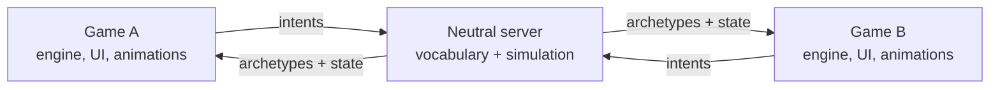

import { Callout } from 'nextra/components'

# Intents, archetypes and translation profiles

<Callout type="warning">
**Draft proposal, not part of Signet/1.** Nothing here is implemented yet. Names, fields and the API are a sketch to discuss. Open a [discussion](https://github.com/signetprotocol/signetprotocol/discussions) or an issue with the `protocol` label to give feedback.
</Callout>

Download the full design document as a PDF: [Signet 2 architecture (PDF)](/signet-2-architecture.pdf). The companion tool is described in [Signet Forge](/forge/).

## The problem

A translator today converts one game's world into another game's world. It works, but every new game has to understand every other one, and each pair of games ends up with its own special cases: a gun in Doom is not a gun in Minecraft, and a jump is not the same jump in every engine.

## The idea

Stop translating game to game. Translate **game to meaning, and meaning to game**.

- The server only understands **meaning**: what a player wants to do (an *intent*) and what exists in the world (an *archetype*). It never knows how anything looks, sounds or animates.
- Every game keeps what makes it that game: its interface, its mechanics, its animations. It only decides **how to show** an archetype and **which input means which intent**.
- The choice is made from a **closed list of candidates**, never invented.



## Three vocabularies

| Name | Lives in | What it is | Example |
|---|---|---|---|
| **Intent vocabulary** | server and SDK | What a player can want to do | `move`, `strafe`, `turn`, `jump`, `crouch`, `fire`, `use`, `switch_weapon` |
| **Archetype catalog** | server and SDK | What exists in the world, without a shape | `weapon.ranged`, `weapon.melee`, `armor`, `health_pickup` |
| **Appearance palette** | each translator | The things a game has that can stand for an archetype | Minecraft: `bow`, `crossbow`, `fishing_rod` |

Signet/1 already has the seed of the first two: `Intencion` carries `avance`, `lateral`, `yaw`, `correr`, `disparar`, `usar` and `arma`, and the weapons `ARMA_PUNO`, `ARMA_PISTOLA` and `ARMA_ESCOPETA` are neutral archetypes that each viewer draws its own way. This proposal grows both lists and adds the palette and the resolver.

## Capabilities

When a client connects it declares what it can do:

- which intents it can **emit** (a game without jumping never emits `jump`),
- which archetypes it can **show**, and with what palette.

The server uses the common subset. If a game cannot express an intent, the server ignores it or approximates it, and says so, instead of failing. This is how an older or simpler game can play next to a newer one without losing the match.

## The translation API

One API, two directions. Both take a closed list of candidates and return them **ranked**:

```text
to_intent(context, intent_vocabulary)   -> ranked intents
to_appearance(archetype, palette)       -> ranked appearances
```

A resolver can be a plain lookup table, a person, or a model. They are interchangeable behind the same API.

## Calibration: set it up before playing

Before the first match the player (or the translator's author) runs a short guided setup, like configuring the controls of any game:

1. "Hold forward for two seconds." The setup records which raw input the player used and binds it to the `move` intent. The same for strafing, turning, firing, switching weapons.
2. For a few simple intents, it **measures** how this particular game behaves: walking and running speed, strafing speed, jump height, turn rate, eye height, step height. This is the *motion profile*, and it is what makes the result faithful.
3. For archetypes, it shows the candidates from the game's palette and lets the player choose, with a model's suggestion highlighted.

Intents are grouped in three tiers by how hard they are:

| Tier | Examples | How it is solved |
|---|---|---|
| 0 · obvious | forward, back, strafe, turn, fire | Calibrated by the player: exact, no model |
| 1 · parametric | run, jump, crouch | Calibrated and measured |
| 2 · complex | abilities, inventory, emotes, vehicles | A model suggests, a person confirms |

<Callout type="info">
Calibration only reads **the player's own input devices** and what the game officially exposes (an open-source engine, a mod API the game allows, a server you control). It does not inject code into online games and does not bypass anti-cheat. A closed game with no legitimate way to read or drive it is out of scope. See the [legal principles](/legal/).
</Callout>

## Translation profiles: decisions that stay decided

Every decision is saved in a **translation profile**, next to the translator's `signet.json`. It works like a lock file: once a choice is pinned, the result is always the same.

```json
{
  "key": "archetype:weapon.ranged",
  "choice": "minecraft:bow",
  "source": "human",
  "candidates": [["minecraft:bow", 0.81], ["minecraft:crossbow", 0.74], ["minecraft:fishing_rod", 0.22]],
  "resolver": "clm-v0.1-8b",
  "pinned": true
}
```

**Resolution order:** a pin from the player, then the translator's own profile, then the resolver's suggestion, then a safe default.

**When something is not registered**, the policy is configurable: *strict* (ignore it), *suggest* (use the best candidate, marked provisional, and queue it for review) or *ask* (decide in the development tool).

**Determinism:** intents that affect the simulation (moving, firing) must always come from the pinned profile, or client prediction and server would drift apart. Appearance is local to each client, so it can stay provisional without desynchronising anyone.

Because the profile lives in git, the community can improve a translator with a pull request.

## Resolvers

| Backend | Use |
|---|---|
| Lookup table (the profile) | Always first. Fast and deterministic |
| Local ranking model | Only on a miss. For example a contrastive ranker such as [CLM-v0.1-8B](https://huggingface.co/Contrastive-LM/CLM-v0.1-8B), which scores candidates and cannot invent new ones. It is released under Apache-2.0 |
| A person | Always has the last word |

The model is **not** in the per-tick path: the server simulates at 20 Hz and a model of that size needs a GPU. It runs offline or on a miss, and its result goes into the profile.

We have **not** validated any model for this yet. The proposed experiment is below.

## Learning from decisions

Every approved choice is a training example: *state, candidates, chosen*. With enough of them a ranker can be fine-tuned for games. Rules for the dataset:

- Only names and identifiers, never game files, textures, sounds or models.
- Contributed under an open license.
- Nothing about the player: no usernames, no input logs.

## Experiment before committing

1. Write about 30 cases (for example `weapon.ranged` against the palettes of Minecraft, Doom and OpenArena, and 10 intent mappings).
2. Compare three resolvers: hand-written rules, a plain text-embedding similarity and a contrastive ranker.
3. Measure top-1 accuracy and how often a person overrides the suggestion.
4. Decide whether a model belongs in the architecture at all.

## Compatibility

Signet/1 is append-only, so the first step can be additive: an optional `capabilities` field in the greeting, and optional archetype identifiers next to the existing weapon numbers. The English wire vocabulary and anything that renames fields belongs to Signet/2. See [versioning](/protocol/versioning/).

## Open questions

- The server still needs a canonical physics. Intents do not remove that. What is the minimum a motion profile must capture?
- How do we measure a motion profile in a game that does not report positions?
- Who maintains the intent vocabulary and the archetype catalog, and how are new entries accepted? (See [governance](https://github.com/signetprotocol/signetprotocol/blob/main/GOVERNANCE.md).)
- Where does the resolver run: the player's machine, a shared service, or only in the development tool?
- How are conflicting community profiles for the same game resolved?
